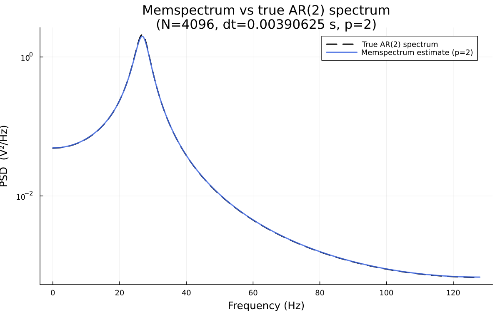
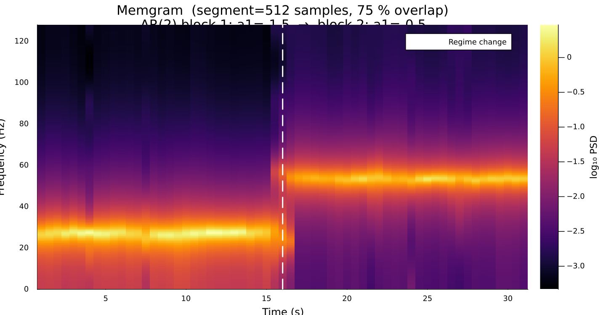
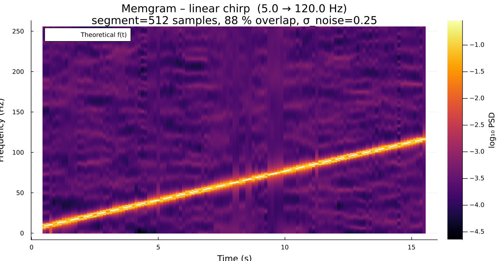
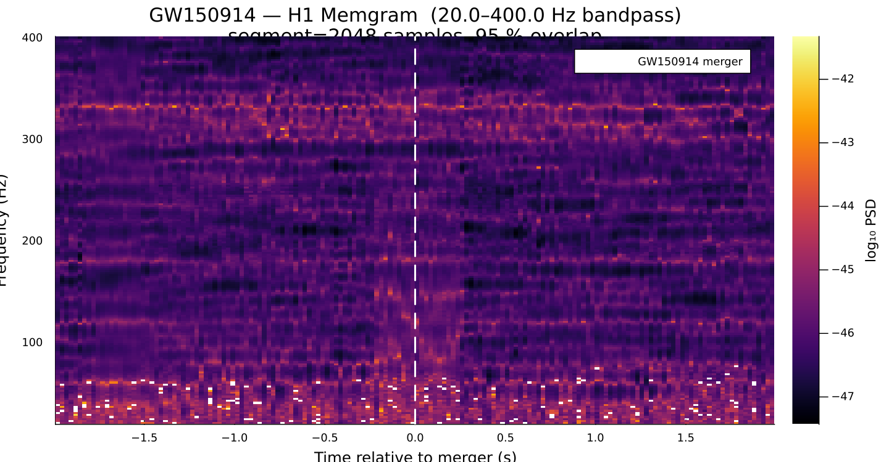

**Authors** Alessandro Martini, Stefano Schmidt, Walter del Pozzo, Riccardo Buscicchio

**Licence** CC BY 4.0

**Version** 1.4.0

# Memspectrum.jl — Maximum Entropy Spectral Analysis

`Memspectrum.jl` is a Julia package for Maximum Entropy Spectral Analysis (MESA)
via Burg's algorithm.  It provides two core outputs:

| Output | Function | Description |
|--------|----------|-------------|
| **Memspectrum** | `memspectrum` | Power spectral density (PSD) of a time series |
| **Memgram**     | `memgram`     | Time–frequency spectrogram via overlapping MESA estimates |

The method is fast, reliable, and outperforms classical spectral estimators
(e.g. the periodogram).

> **Python counterpart:** this package is the Julia port of
> [`memspectrum`](https://github.com/martini-alessandro/Maximum-Entropy-Spectral-Analysis),
> the original Python implementation by Alessandro Martini et al.

The PSD is expressed in terms of autoregressive (AR) coefficients `a_k` plus an
overall scale factor `P`.  The AR coefficients are obtained recursively through
the Levinson recursion and characterise the time series as an AR(p) process,
enabling high-quality forecasting.

## Installation

From Julia's package manager:

```julia
using Pkg
Pkg.add(url="https://github.com/RiccardoBuscicchio/memspectrogram")
```

Or, if working from a local clone:

```julia
using Pkg
Pkg.activate(".")   # from the repository root
Pkg.instantiate()
```

## Usage

```julia
using Memspectrum
```

### Compute the Memspectrum (PSD)

```julia
m = MESA()
solve!(m, data)                              # fit AR model (Float64 vector)
f, psd = memspectrum(m, dt)                 # Memspectrum on sampling frequencies
psd_custom = memspectrum(m, dt; frequencies=f_grid)  # on a custom grid
```

### Compute the Memgram (spectrogram)

```julia
t_centers, f_grid, psd_matrix = memgram(x, dt; segment_length=512)
plt = plot_spectrogram(t_centers, f_grid, psd_matrix)
```

### Forecast future observations

```julia
predicted = forecast(m, data, 100; number_of_simulations=1000)
# predicted has shape (1000, 100)
```

### Whiten data

```julia
white_data = whiten(m, data)
```

### Generate coloured noise matching a template PSD

```julia
t, ts, freqs, fs, psd_interp = generate_data(f, psd_template, T;
                                              sampling_rate=4096.0, seed=0)
```

### Save / load a fitted model

```julia
save_mesa(m, "model.txt")
m2 = load_mesa("model.txt")
```

### GPU acceleration

Load `CUDA.jl` before `Memspectrum` to enable GPU-accelerated `forecast`
and `memgram`:

```julia
using CUDA
using Memspectrum

t, f, S = memgram(x, dt; segment_length=512, use_gpu=true)
sims = forecast(m, data, 1000; number_of_simulations=2048, use_gpu=true)
```

## Examples

### Memspectrum — PSD estimate vs true AR(2) spectrum



### Memgram — non-stationary AR(2) signal



### Memgram — linear chirp signal



### Memgram — GW150914 (real LIGO data)



### Memgram — GW170817 (real LIGO data)


Run the example scripts from the repository root:

```sh
julia --project=. examples/toy_psd_estimate.jl
julia --project=. examples/toy_spectrogram.jl
julia --project=. examples/chirp_spectrogram.jl
julia --project=. examples/gw150914_spectrogram.jl
julia --project=. examples/gw170817_spectrogram.jl
```

Every example accepts command-line flags **and** an optional TOML config file:

```sh
julia --project=. examples/toy_psd_estimate.jl \
    --config examples/configs/toy_psd_estimate.toml
```

Generate LIGO-like noise from the O3 design PSD:

```sh
julia examples/generate_white_noise.jl --p 300 --t 32 --srate 4096
```

## References

- Original Burg's algorithm: [J.P. Burg – Maximum Entropy Spectral Analysis](http://sepwww.stanford.edu/data/media/public/oldreports/sep06/)
- Fast implementation: [V. Fastubrg – A Fast Implementation of Burg Method](https://svn.xiph.org/websites/opus-codec.org/docs/vos_fastburg.pdf)
- Method paper: [Maximum Entropy Spectral Analysis: a case study](https://arxiv.org/abs/2106.09499)
- Python package: [martini-alessandro/Maximum-Entropy-Spectral-Analysis](https://github.com/martini-alessandro/Maximum-Entropy-Spectral-Analysis)
