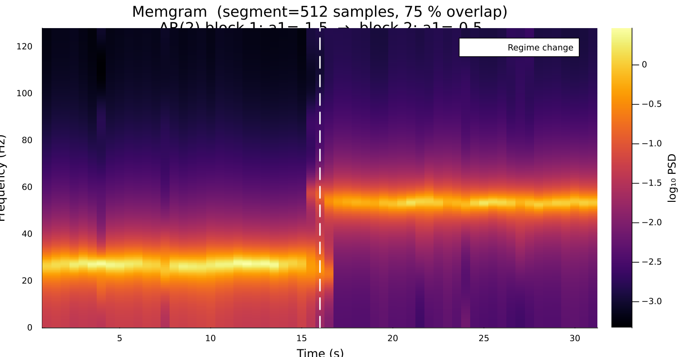
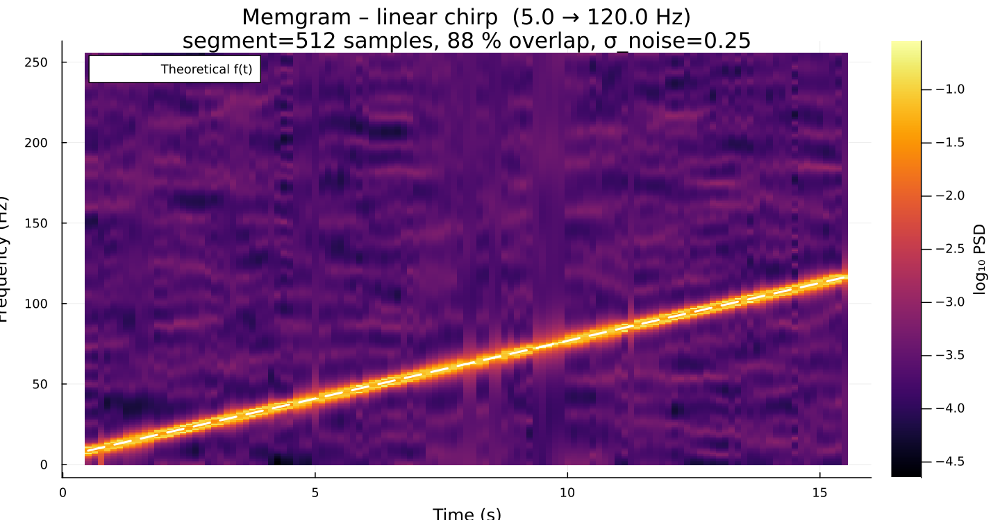

# Examples

The `examples/` directory in the repository contains ready-to-run scripts.
All scripts accept command-line flags **and** a `--config` TOML file.

---

## Toy PSD estimate

Generates an AR(2) synthetic time series and compares the MESA estimate against
the known analytical spectrum.

```sh
julia --project=. examples/toy_psd_estimate.jl
```


---

## Toy Memgram

Generates a non-stationary AR(2) signal and computes the Memgram.

```sh
julia --project=. examples/toy_spectrogram.jl
```



---

## Chirp Memgram

Generates a linear chirp and computes the Memgram, overlaying the theoretical
instantaneous frequency.

```sh
julia --project=. examples/chirp_spectrogram.jl
```



---

## Generate LIGO-like noise

Downloads the LIGO O3 design PSD and generates matching coloured noise.

```sh
julia --project=. examples/generate_white_noise.jl --p 300 --t 32 --srate 4096
# or with a config file:
julia --project=. examples/generate_white_noise.jl --config examples/configs/generate_white_noise.toml
```

---

## Configuration files

Every example script reads parameters from an optional TOML config file passed
via `--config <file>`.  Command-line flags override config-file values.
Example:

```toml
# examples/configs/toy_psd_estimate.toml
N    = 4096
dt   = 0.00390625   # 1/256
seed = 42
optimisation_method = "FPE"
method = "Fast"
```
